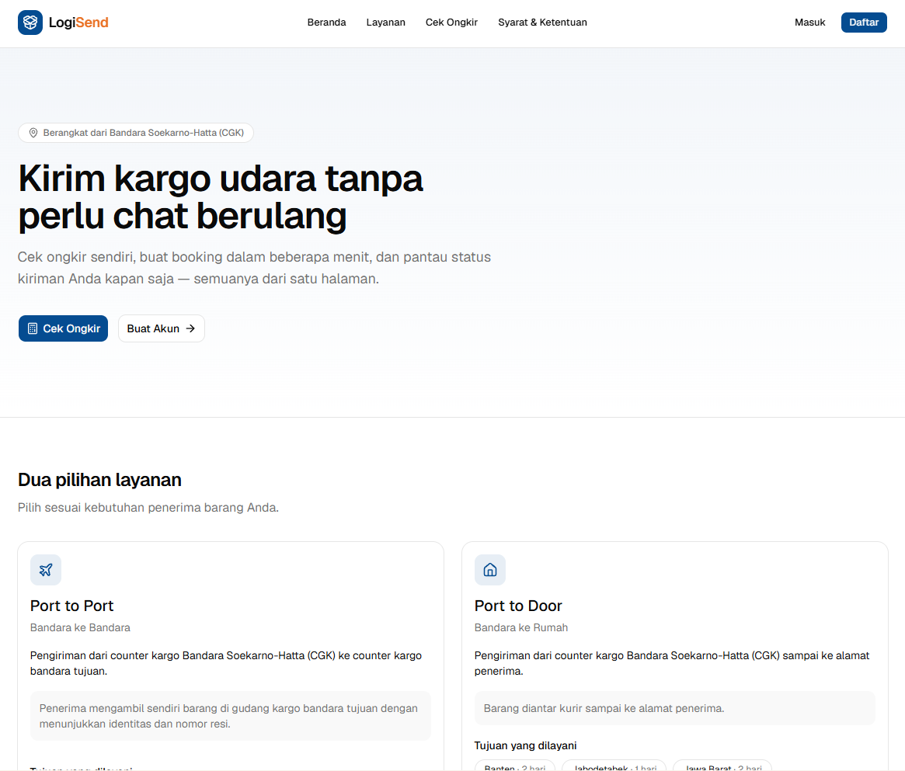
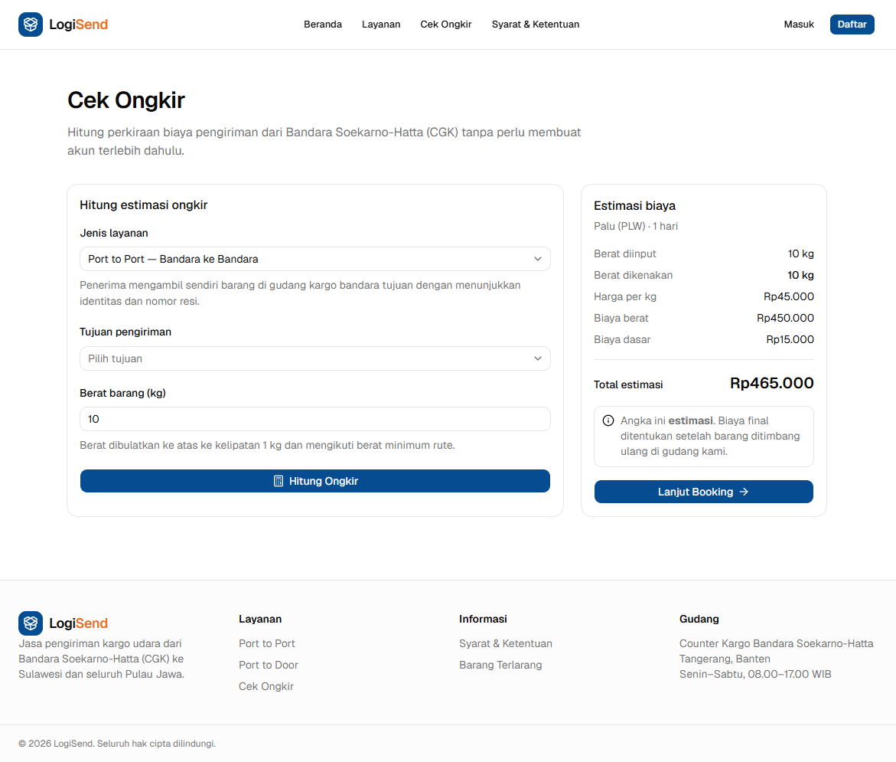
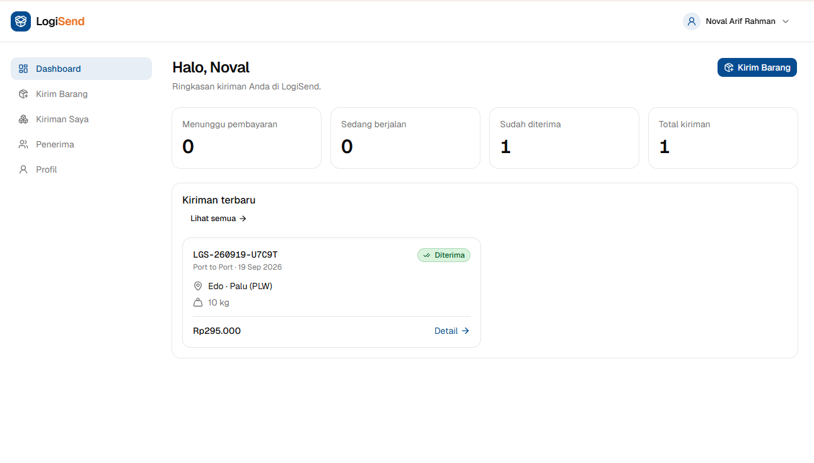
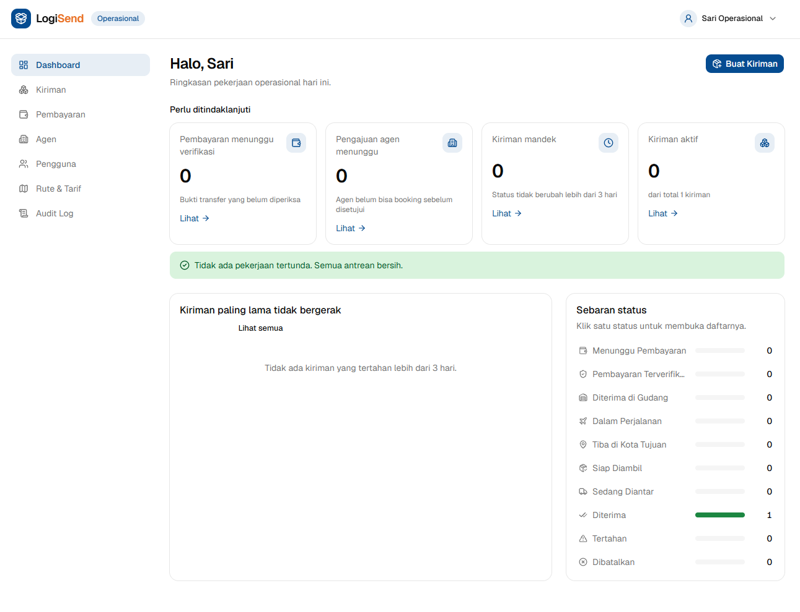

# LogiSend — Frontend

Antarmuka web LogiSend: jasa pengiriman kargo udara dari Bandara Soekarno-Hatta
(CGK) ke Sulawesi (port-to-port) dan seluruh Pulau Jawa (port-to-door).

**[Lihat demo →](https://crack-fe-nofalariff.vercel.app)** · Frontend di Vercel,
API NestJS di Railway, database dan penyimpanan berkas di Supabase.

Spesifikasi produk lengkap ada di [`PRD.md`](../PRD.md) pada folder induk. Setiap
keputusan di repo ini mengacu ke sana.

## Tangkapan layar

|                                                               |                                                              |
| ------------------------------------------------------------- | ------------------------------------------------------------ |
|                       |                |
| **Beranda** — dua pilihan layanan dan tujuan yang dilayani    | **Cek Ongkir** — estimasi biaya tanpa perlu membuat akun     |
|          |      |
| **Dashboard customer** — ringkasan status dan kiriman terbaru | **Dashboard operasional** — antrean kerja dan sebaran status |

## Cakupan fase ini

Seluruh grup route sudah terisi: `(public)`, `(auth)`, `(dashboard)`, dan
`(admin)`. **Halaman cetak label & manifest (FR-ADM-02/03) belum dikerjakan** dan
direncanakan sebagai fase terpisah.

| Area      | Halaman                                                                                                                                                                                  |
| --------- | ---------------------------------------------------------------------------------------------------------------------------------------------------------------------------------------- |
| Publik    | Landing, Layanan, Cek Ongkir, Syarat & Ketentuan                                                                                                                                         |
| Auth      | Masuk, Daftar (B2C), Daftar Agen (B2B)                                                                                                                                                   |
| Dashboard | Ringkasan, Kirim Barang, Kiriman Saya, Detail & Linimasa Status, Invoice, Unggah Bukti Bayar, Ubah Kiriman, Buku Alamat, Profil, Status Pengajuan Agen                                   |
| Admin     | Dashboard Operasional, Kiriman (filter + aksi massal), Detail & Pemrosesan Kiriman, Buat Kiriman Walk-in, Verifikasi Pembayaran, Approval Agen, Kelola Pengguna, Rute & Tarif, Audit Log |

### Alur operasional yang ditutup fase admin

Sebelumnya kiriman mentok di _Menunggu Pembayaran_ karena tidak ada yang bisa
memverifikasi bukti transfer. Sekarang lingkarannya utuh: admin memverifikasi
pembayaran, menggerakkan status mengikuti state machine PRD §8.3 (satuan maupun
massal), mengoreksi berat timbang beserta dampak tagihannya, menyetujui agen,
mengelola akun, dan mengatur rute serta tarif — semuanya tercatat di audit log.

## Menjalankan

```bash
bun install
cp .env.example .env.local
bun dev                       # http://localhost:3000
```

Secara bawaan (`NEXT_PUBLIC_API_MOCKING=enabled`) aplikasi berjalan di atas
**mock MSW** yang meniru kontrak API PRD §10 — termasuk envelope response,
paginasi, dan seluruh kode error domain. Mock ini tetap dipertahankan supaya
pengembangan UI dan rangkaian E2E tidak bergantung pada backend yang menyala.

Backend aslinya (`crack-be-nofalariff`) sudah berjalan di production; arahkan
`API_URL` ke sana dan set `NEXT_PUBLIC_API_MOCKING=disabled` untuk memakainya.

### Akun uji (tersedia saat mock aktif)

| Peran                       | Email                  | Password      |
| --------------------------- | ---------------------- | ------------- |
| Customer B2C                | `budi@example.com`     | `password123` |
| Agen (disetujui)            | `agen@example.com`     | `password123` |
| Agen (menunggu persetujuan) | `agenbaru@example.com` | `password123` |
| Admin / Operasional         | `admin@logisend.id`    | `password123` |

Akun admin mendarat di `/admin`. Akun lain yang ikut di-seed untuk mengisi
antrean operasional: `dewi@example.com`, `rahmat@example.com`,
`kargo@example.com` (agen disetujui), `agenkedua@example.com` (agen menunggu
approval), `agenditolak@example.com` (agen ditolak), dan `nonaktif@example.com`
(akun ditangguhkan) — seluruhnya dengan password yang sama.

Data mock bersifat **stateful selama proses server hidup**: booking yang dibuat
benar-benar muncul di daftar kiriman, dan unggahan bukti benar-benar mengubah
status pembayaran. Restart `bun dev` mengembalikannya ke data awal.

## Perintah

| Perintah            | Kegunaan                           |
| ------------------- | ---------------------------------- |
| `bun dev`           | Server pengembangan                |
| `bun run build`     | Build produksi                     |
| `bun run typecheck` | Pemeriksaan tipe TypeScript        |
| `bun run lint`      | ESLint                             |
| `bun run format`    | Prettier                           |
| `bun test`          | Unit test (Vitest)                 |
| `bun run test:e2e`  | E2E (Playwright, desktop + mobile) |

Pengujian admin yang mengubah data (`e2e/admin-flow.spec.ts`) hanya dijalankan di
viewport desktop, karena mock berbagi satu state per proses server. Tampilan
panel admin tetap diuji di mobile lewat `e2e/admin-view.spec.ts`.

## Environment

| Variabel                  | Keterangan                                                       |
| ------------------------- | ---------------------------------------------------------------- |
| `API_URL`                 | URL backend. Hanya dipakai di server, tidak diekspos ke browser. |
| `NEXT_PUBLIC_APP_URL`     | URL publik aplikasi (metadata & Open Graph).                     |
| `NEXT_PUBLIC_APP_NAME`    | Nama aplikasi di UI.                                             |
| `NEXT_PUBLIC_API_MOCKING` | `enabled` \| `disabled` — menyalakan mock MSW.                   |

Nilainya divalidasi saat boot di [`src/env.ts`](src/env.ts); aplikasi menolak
jalan bila ada yang kosong atau salah format.

## Struktur

```
src/
├── app/
│   ├── (public)/      # landing, cek-ongkir, layanan, syarat-ketentuan
│   ├── (auth)/        # masuk, daftar, daftar/agen
│   ├── (dashboard)/   # dashboard, kirim, kiriman, penerima, profil
│   ├── (admin)/       # area operasional: kiriman, pembayaran, agen, rute, audit
│   └── api/files/     # proxy terautentikasi untuk bukti pembayaran
├── components/
│   ├── ui/            # shadcn/ui (dikelola generator)
│   ├── layout/        # header, footer, sidebar, banner status agen
│   ├── booking/       # wizard booking + ringkasan biaya
│   ├── shipment/      # badge status, linimasa, filter, dialog
│   ├── admin/         # tabel & dialog operasional, kartu statistik
│   └── shared/        # field form, empty state, tombol submit, paginasi
├── lib/
│   ├── api/           # klien HTTP + pemetaan error domain
│   ├── auth/          # sesi cookie, Server Action, akses sesi
│   ├── actions/       # Server Action per domain
│   ├── validations/   # skema Zod (cermin aturan backend)
│   ├── constants/     # status, layanan, navigasi, barang terlarang
│   └── format.ts      # rupiah, tanggal WIB, berat, nomor HP
├── mocks/             # MSW: data, handler customer & admin, audit log
├── types/api.ts       # tipe kontrak PRD §10
├── instrumentation.ts # menyalakan MSW di runtime server
└── proxy.ts           # guard rute (dulu bernama middleware.ts)
```

## Keputusan teknis penting

- **Next.js 16** — `middleware.ts` kini bernama `proxy.ts`, dan API request
  (`cookies()`, `params`, `searchParams`) bersifat async.
- **Browser tidak pernah memanggil backend langsung.** Seluruh request data
  berjalan lewat Server Component dan Server Action, sehingga token hidup di
  httpOnly cookie dan tidak ada persoalan CORS di sisi klien.
- **Otorisasi sebenarnya ada di backend.** `proxy.ts` hanya pemeriksaan
  optimistis agar pengguna tidak melihat halaman kosong sebelum dialihkan.
- **Status approval agen selalu dibaca dari backend**, bukan dari klaim token,
  supaya agen yang baru disetujui langsung bisa booking tanpa login ulang.
- **Filter daftar kiriman disimpan di URL**, bukan state komponen — hasilnya bisa
  di-bookmark, dibagikan, dan tahan refresh.
- **Label status kiriman hanya didefinisikan di satu tempat**
  ([`src/lib/constants/shipment-status.ts`](src/lib/constants/shipment-status.ts)).
  Jangan menulis label status langsung di komponen.
- **Estimasi vs final**: seluruh angka ongkir di UI diberi label estimasi, karena
  tagihan final ditentukan setelah penimbangan ulang di gudang.
- **State machine status ada di satu tempat**
  ([`src/lib/constants/shipment-status.ts`](src/lib/constants/shipment-status.ts))
  dan dipakai dua arah: UI hanya menawarkan transisi yang sah, backend menolak
  yang tidak sah. Menyembunyikan pilihan di UI bukan penegakan aturan.
- **Aksi massal melaporkan yang gagal**, bukan menggagalkan seluruh operasi —
  kiriman yang transisinya tidak sah dilewati beserta alasannya.
- **Perubahan tarif tidak menyentuh kiriman yang sudah terbit**, karena tiap
  kiriman menyimpan snapshot tarifnya sendiri.
- **Input form dikendalikan dari state React**, bukan dibiarkan tak-terkontrol:
  React mengosongkan input tak-terkontrol setelah sebuah form action selesai,
  yang membuat isian pengguna hilang setiap kali validasi gagal.

## Beralih ke backend asli

1. Isi `API_URL` dengan alamat API `crack-be-nofalariff`, lengkap dengan
   akhiran `/api/v1`.
2. Set `NEXT_PUBLIC_API_MOCKING=disabled`.
3. Ganti [`src/types/api.ts`](src/types/api.ts) dengan hasil generate dari
   Swagger backend (`openapi-typescript`) — perbedaan bentuk response akan
   langsung muncul sebagai error TypeScript.
4. Jalankan ulang `bun run test:e2e` terhadap backend asli.

Tidak ada kode aplikasi yang perlu diubah untuk peralihan ini; `src/mocks/`
dipertahankan untuk kebutuhan pengujian.

## Deploy ke Vercel

Panduan lengkap (Supabase → Railway → Vercel) ada di `DEPLOYMENT.md` pada
folder induk proyek. Ringkasnya:

- **Backend harus sudah online sebelum build.** Halaman `/`, `/cek-ongkir`, dan
  `/layanan` mengambil daftar rute saat build (ISR, `revalidate: 300`), jadi
  `next build` gagal bila `API_URL` tidak bisa dijangkau.
- Environment variable (Production **dan** Preview):

  | Variabel                  | Nilai                                                                    |
  | ------------------------- | ------------------------------------------------------------------------ |
  | `API_URL`                 | `https://<domain-railway>/api/v1`                                        |
  | `NEXT_PUBLIC_APP_URL`     | `https://<domain-vercel>`                                                |
  | `NEXT_PUBLIC_APP_NAME`    | `LogiSend`                                                               |
  | `NEXT_PUBLIC_API_MOCKING` | `disabled` — wajib; bila `enabled`, akun mock berkata sandi publik aktif |

- Variabel `NEXT_PUBLIC_*` ditanam saat build — mengubahnya butuh redeploy.
- Header keamanan dipasang di [`next.config.ts`](next.config.ts).
